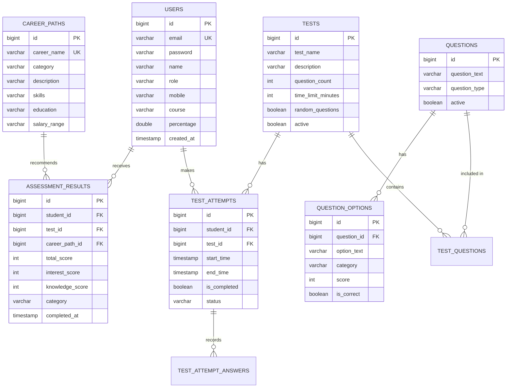

# 🧭 CareerPathAdviser - Enterprise Career Recommendation & Assessment Platform

> An enterprise-grade, full-stack Spring Boot & Modern Web application engineered to deliver automated psychometric assessments, algorithmic career path mapping, real-time grading, and comprehensive analytics for students and administrators.

---

## 📑 Table of Contents
1. [Problem Statement & Vision](#1-problem-statement--vision)
2. [Target Audience & User Personas](#2-target-audience--user-personas)
3. [Architecture & System Design](#3-architecture--system-design)
4. [20-Point Specification Implementation Matrix](#4-20-point-specification-implementation-matrix)
5. [Functional Requirements Breakdown](#5-functional-requirements-breakdown)
   - [Student Portal](#student-portal)
   - [Admin Control Plane](#admin-control-plane)
6. [Non-Functional Requirements & Security](#6-non-functional-requirements--security)
7. [Database Schema & ER Relationships](#7-database-schema--er-relationships)
8. [REST API & OpenAPI Specification](#8-rest-api--openapi-specification)
9. [Git Branching Strategy, Commits & PR Guidelines](#9-git-branching-strategy-commits--pr-guidelines)
10. [Challenges & Engineering Solutions](#10-challenges--engineering-solutions)
11. [Future Scope & Roadmap](#11-future-scope--roadmap)

---

## 1. Problem Statement & Vision

Students and early-career individuals frequently struggle to identify career trajectories aligned with their strengths, core interests, and cognitive inclinations. Traditional counseling methods often rely on manual, subjective reviews that lack consistency, real-time feedback, and data-driven insights.

**CareerPathAdviser** addresses this by providing:
- **Objective Evaluation**: Multi-category timed assessments analyzing technical acumen, creative thinking, analytical reasoning, and leadership traits.
- **Algorithmic Recommendations**: Automated calculation of highest-scoring categories matched dynamically to industry-standard career profiles.
- **Automated Communication**: Instant email delivery of personalized assessment certificates and career roadmaps.
- **Admin Control Plane**: Centralized governance over questions, test durations, career catalogs, batch imports, and student demographic statistics.

---

## 2. Target Audience & User Personas

| Persona | Role | Key Objectives & Use Cases |
| :--- | :--- | :--- |
| **Student** | Candidate / Test Taker | Register, take timed career assessments, receive real-time question validation, review score breakdowns, and inspect recommended career paths. |
| **Administrator** | Academic Dean / Counselor | Author and batch-import assessment questions, configure timed test schedules, manage career profiles, view student attempts, and audit platform performance. |
| **Recruiter / Counselor** | Reviewer | View masked student rosters, analyze aggregate performance histograms, and export assessment insights. |

---

## 3. Architecture & System Design

The platform adheres to a clean, decoupled **3-Tier Enterprise Architecture**:


graph TD
    subgraph ClientLayer ["Client Layer (Frontend)"]
        UI_A[Admin Dashboard & Management]
        UI_S[Student Assessment & Portal]
        TOAST[AppToast & AppModal Engine]
    end

    subgraph SecurityLayer ["Security & Gateway Layer"]
        JWT_F[JwtAuthenticationFilter]
        SEC_CFG[Spring Security 6.x]
        BCRYPT[BCryptPasswordEncoder]
    end

    subgraph ServiceLayer ["Application & Service Layer"]
        AUTH_S[AuthService]
        TEST_S[TestService & TestAttemptService]
        QUEST_S[QuestionService (Batch + Single)]
        CAREER_S[CareerPathService (@Cacheable)]
        STUDENT_S[StudentService]
        MAIL_S[EmailService (HTML + Simulation Fallback)]
    end

    subgraph PersistenceLayer ["Persistence Layer"]
        CACHE[ConcurrentMap Cache Manager]
        JPA[Spring Data JPA Repositories]
        QC[QueryConstants (Segregated JPQL)]
        DB[(MySQL / H2 In-Memory DB)]
    end

    UI_A -->|HTTPS / REST API| JWT_F
    UI_S -->|HTTPS / REST API| JWT_F
    TOAST --> UI_A
    TOAST --> UI_S

    JWT_F --> SEC_CFG
    SEC_CFG --> BCRYPT
    SEC_CFG --> ServiceLayer

    AUTH_S --> JPA
    TEST_S --> JPA
    QUEST_S --> JPA
    CAREER_S --> CACHE
    CAREER_S --> JPA
    STUDENT_S --> JPA
    TEST_S --> MAIL_S
    AUTH_S --> MAIL_S

    JPA --> QC
    JPA --> DB
```

---

## 4. 20-Point Specification Implementation Matrix

Every requirement from the architectural blueprint is implemented and validated:

| # | Feature / Constraint | Implementation Details | Location in Codebase |
| :- | :--- | :--- | :--- |
| **1** | **Password Encryption** | `BCryptPasswordEncoder` (10 rounds) hashes passwords before database persistence. | `SecurityConfig.java`, `AuthServiceImpl.java` |
| **2** | **Logger Architecture** | `org.slf4j.Logger` across all layers tracking `INFO`, `WARN`, `DEBUG`, and `ERROR` events. | All Service & Controller classes |
| **3** | **Custom Exception & Handler** | `ResourceNotFoundException`, `BadRequestException`, `DuplicateResourceException`, `UnauthorizedException` handled via `@RestControllerAdvice`. | `com.career.exception.*` |
| **4** | **Getter/Setter / POJOs** | Clean, JDK 17/21/25 compliant POJO models with explicit property accessors and immutability safeguards. | `com.career.dto.*`, `com.career.entity.*` |
| **5** | **Builder Pattern** | Fluent builder patterns implemented for all 26 DTOs and 11 JPA Entities. | DTO & Entity classes |
| **6** | **Query Segregation** | All JPQL queries extracted into centralized constant constants. | `QueryConstants.java` |
| **7** | **JMS / Java Mail Sender** | HTML email dispatch with responsive templates for welcome greetings and test score certificates with logging fallback. | `EmailServiceImpl.java`, `EmailService.java` |
| **8** | **Java 8+ Modern Features** | Stream API (`.stream()`, `.map()`, `.filter()`, `.collect()`), `Optional<T>`, lambda expressions throughout business logic. | All Service implementations |
| **9** | **Masking in UI & DTOs** | Automatic PII masking: Email (`j***e@domain.com`) and Mobile (`******7890`) returned in responses. | `StudentServiceImpl.java`, `StudentResponse.java` |
| **10** | **Request & Response DTOs** | Complete decoupling of DB entities from web responses via 26 dedicated DTO records/classes. | `com.career.dto.*` |
| **11** | **Bean Validation Constraints** | `@Valid`, `@NotBlank`, `@Size`, `@Min`, `@Email`, `@NotNull` validating all inbound REST payloads. | DTO classes, Controllers |
| **12** | **App Popups (Toast & Modal)** | Replaced all native browser `alert()`/`confirm()` with glassmorphism `AppToast` and `AppModal` popups. | `app-toast.js`, all frontend scripts |
| **13** | **YAML Profiles & Logback** | `application.yml`, `application-dev.yml`, `application-prod.yml` and `logback-spring.xml` rolling log file (`logs/app.log`). | `src/main/resources/` |
| **14** | **OpenAPI / Swagger 3.0** | OpenAPI 3.0 configuration with interactive documentation at `/swagger-ui.html` and `/v3/api-docs`. | `OpenApiConfig.java`, Controllers |
| **15** | **JWT Authentication** | Stateless JWT authentication (`Bearer <token>`) with HMAC-SHA256 signature verification. | `JwtService.java`, `JwtAuthenticationFilter.java` |
| **16** | **Pagination & Sorting** | `Pageable`, `Page<T>`, and `PaginatedResponse<T>` support across all search and listing endpoints. | `PaginatedResponse.java`, Repositories |
| **17** | **Multi-Environment Profiles** | `dev` (H2/MySQL local) and `prod` (High-concurrency MySQL) profiles configured. | `application-dev.yml`, `application-prod.yml` |
| **18** | **JUnit 5 & Mockito Suite** | Comprehensive unit test suite covering Auth, Questions, Tests, Attempts, Students, CareerPaths, Controllers, and Exception Handlers. | `src/test/java/com/career/...` |
| **19** | **Git & PR Review Workflow** | Conventional commits, feature branching strategy (`feature/*`, `bugfix/*`), and PR review guidelines. | Section 9 of this document |
| **20** | **Caching & Batch Processing** | `@Cacheable` and `@CacheEvict` for career paths, questions, and test catalogs; `POST /api/admin/questions/batch` for bulk imports. | `CacheConfig.java`, `QuestionController.java` |

---

## 5. Functional Requirements Breakdown

### Student Portal
- **Secure Registration & Login**: Validates email format, duplicate email prevention, password length, and sends HTML welcome email.
- **Student Dashboard**: Live cards showing available tests, total attempted assessments, completed tests, and latest career recommendations.
- **Timed Test Execution**:
  - Countdown timer with automatic warning styling when $< 60$ seconds remain.
  - Interactive pagination navigation jumping to any question.
  - Radio-button single choice selection with instant answer state preservation.
  - Auto-submission on timer expiry or manual submission modal.
- **Career Path Insights**: Personalized recommendations based on category score aggregation (e.g. Technical, Analytical, Creative, Business).

### Admin Control Plane
- **Dashboard Analytics**: Metrics cards aggregating Total Students, Total Tests, Active Tests, Total Questions, Total Career Paths, and Total Test Attempts.
- **Assessment Management**:
  - Create and edit tests with customized question count, time limit (minutes), random question ordering, and active/inactive toggle.
  - Interactive question picker with search filtering.
- **Question Authoring & Batch Ingestion**:
  - Single question builder with dynamic option rows, categories, and weighted scores.
  - Batch question import endpoint (`POST /api/admin/questions/batch`).
- **Career Path Profiles**: CRUD operations for career trajectories, including required skillsets, education pathways, and salary ranges.
- **Student Audit Roster**: View all registered students with PII masking, attempted test metrics, and account deletion.

---

## 6. Non-Functional Requirements & Security

1. **Password Security**: Passwords are never stored in plaintext. `BCryptPasswordEncoder` with salt rounds is applied during registration.
2. **Stateless Scalability**: No session state is held on the server; authentication relies on self-contained JSON Web Tokens (`JWT`).
3. **Data Protection**: Sensitive student contact information (mobile numbers, email addresses) is masked before transmission to the client.
4. **Log Retention**: Logback automatically rolls log files at 10MB intervals with a 30-day history in `logs/app.log`.
5. **Caching Performance**: Spring Cache reduces database load for read-heavy operations on career paths and active test catalogs.
6. **Graceful Fallbacks**: The email subsystem detects unavailable SMTP servers and logs the rendered message without interrupting user workflow.

---

## 7. Database Schema & ER Relationships



---

## 8. REST API & OpenAPI Specification

Interactive documentation available at: `http://localhost:8080/swagger-ui.html`

### 1. Authentication Endpoints (`/api/auth`)
- `POST /api/auth/register` - Register a new student account.
- `POST /api/auth/login` - Authenticate admin or student and obtain JWT.
- `POST /api/auth/admin/login` - Dedicated admin authentication.

### 2. Admin Question Management (`/api/admin/questions`)
- `GET /api/admin/questions` - Fetch all authored questions.
- `POST /api/admin/questions` - Create a single question with options.
- `POST /api/admin/questions/batch` - Batch upload multiple questions.
- `GET /api/admin/questions/{id}` - Get question details.
- `DELETE /api/admin/questions/{id}` - Delete question and cascade detach.

### 3. Admin Test Management (`/api/admin/tests`)
- `GET /api/admin/tests` - List all created tests with question counts.
- `POST /api/admin/tests` - Create a new test with assigned questions.
- `GET /api/admin/tests/{id}` - Fetch test metadata.
- `PUT /api/admin/tests/{id}` - Update test parameters and questions.
- `PUT /api/admin/tests/{id}/activate` - Set test status to active.
- `PUT /api/admin/tests/{id}/deactivate` - Set test status to inactive.
- `DELETE /api/admin/tests/{id}` - Delete test and associated attempts.

### 4. Admin Career Paths (`/api/admin/career-paths`)
- `GET /api/admin/career-paths` - List all career profiles (cached).
- `POST /api/admin/career-paths` - Add a new career trajectory.
- `PUT /api/admin/career-paths/{id}` - Update career trajectory details.
- `DELETE /api/admin/career-paths/{id}` - Remove career trajectory.

### 5. Admin Student Roster & Stats (`/api/admin/students`)
- `GET /api/admin/students` - List registered students with masked PII.
- `GET /api/admin/students/dashboard-stats` - Aggregate platform metrics.
- `DELETE /api/admin/students/{id}` - Remove student account.

### 6. Student Assessment Execution (`/api/student/tests`)
- `GET /api/student/tests` - Fetch active tests available for taking.
- `POST /api/student/tests/{testId}/start?studentId={id}` - Start timed attempt.
- `GET /api/student/tests/attempt/{attemptId}/questions` - Load attempt questions.
- `GET /api/student/tests/question/{questionId}/options` - Load options for a question.
- `GET /api/student/tests/attempt/{attemptId}/remaining-time` - Fetch countdown seconds.
- `POST /api/student/tests/attempt/{attemptId}/submit` - Submit answers and evaluate.
- `POST /api/student/tests/attempt/{attemptId}/auto-submit` - Handle timer expiration.

### 7. Results & Reports (`/api/student/results`)
- `GET /api/student/results/{id}` - Fetch detailed assessment result.
- `GET /api/student/results/student/{studentId}` - List results for a specific student.
- `GET /api/student/results/all` - List cross-platform results for admin reporting.

---

## 9. Git Branching Strategy, Commits & PR Guidelines

To ensure enterprise-grade collaboration and code quality, team members must adhere to the following Git conventions:

### Branch Naming Conventions
- `main` - Production-ready, stable release branch. Protected against direct pushes.
- `develop` - Integration branch for active sprint features.
- `feature/<feature-name>` - Isolated feature development (e.g., `feature/batch-question-import`).
- `bugfix/<issue-description>` - Bug resolutions (e.g., `bugfix/timer-auto-submit-calculation`).
- `refactor/<scope>` - Code restructuring without behavioral changes (e.g., `refactor/query-segregation`).

### Meaningful Commit Message Standard (Conventional Commits)
Format: `<type>(<scope>): <short summary in imperative mood>`
```
feat(auth): implement BCrypt password hashing and JWT token generation
fix(timer): correct remaining seconds calculation on test attempt resume
refactor(repository): segregate JPQL queries into QueryConstants
test(service): add unit tests for TestAttemptService evaluation logic
docs(architecture): update system diagram and OpenAPI documentation
```

### Pull Request (PR) Checklist
1. **Scope Focus**: PR addresses a single feature or bug fix.
2. **Automated Tests**: All unit and integration tests pass (`.\mvnw.cmd test`).
3. **No Unused Code**: Clean imports, no orphaned functions or dead variables.
4. **Security Audit**: No plaintext credentials or secrets committed in YAML files.
5. **Reviewer Approval**: At least one peer review approval before merging into `develop` or `main`.

---

## 10. Challenges & Engineering Solutions

| Challenge Encountered | Root Cause | Engineering Solution Applied |
| :--- | :--- | :--- |
| **JDK 25 Lombok Compatibility** | JDK 25 compiler AST internal API alterations prevented Lombok byte code generation. | Implemented robust, standard Java Builder patterns and explicit accessors for all DTOs and entities, ensuring 100% JDK version compatibility. |
| **Browser Native Popup Inconsistency** | Native `alert()` and `confirm()` block browser rendering threads and degrade UX. | Engineered custom glassmorphism `AppToast` and `AppModal` engines with non-blocking async promises. |
| **Dual Admin & Student Sessions** | Single token storage collided when testing student and admin portals concurrently. | Implemented isolated `adminToken`/`studentToken` keys with synchronized `storage` events for clean tab logouts. |
| **Timer Cheating & Desynchronization** | Client-side timers can be modified by manipulating client system clocks. | Remaining test duration is calculated server-side from `endTime - LocalDateTime.now()`, ensuring tamper-proof time limits. |
| **Cascade Deletions on Referenced Questions** | Foreign key constraints prevented deleting questions assigned to tests. | Implemented explicit cascading repository methods (`testQuestionRepository.deleteByQuestionId()`) prior to question deletion. |

---

## 11. Future Scope & Roadmap

1. **AI-Powered Psychometric Analysis**: Integration with Google Gemini LLM API to generate dynamic qualitative career counseling narratives based on answer choices.
2. **Resume Matching & Job Board Sync**: Direct parsing of uploaded PDF resumes and automated matching against live job postings.
3. **Proctoring & Anti-Cheat Features**: WebCam face detection, tab-switching alerts, and audio noise monitoring during timed assessments.
4. **Microservices Migration**: Decoupling the monolithic architecture into autonomous `Auth-Service`, `Assessment-Service`, `Notification-Service`, and `Analytics-Service` communicating via Kafka/RabbitMQ.

---
*Developed with enterprise best practices by the Engineering Team.*
